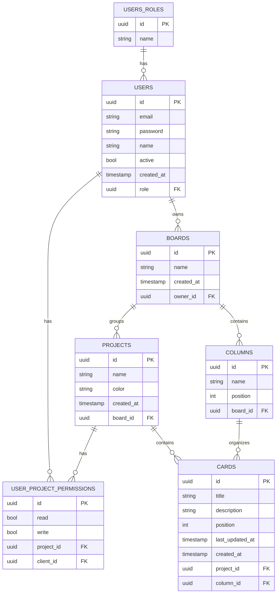

# Boardly (MVP)

A modern **Kanban board built for freelancers** who work with multiple clients.

This app lets freelancers manage all their projects in a **single unified board**, while giving each client transparent access to their tasks — and **blurred visibility** into other projects, showing that the freelancer is active without revealing sensitive information.

---

## 🚀 Vision

> Transparency for clients. Privacy for freelancers.  
> One board. Clear progress. Blurred boundaries.

Freelancers often juggle several projects at once, but most project management tools isolate boards per client.  
**Boardly** introduces a unified workspace where all tasks live together — clients see their cards clearly, while others appear blurred or abstracted.

---

## 🧩 MVP Checklist

### 🔐 Authentication & Roles

- [x] Implement sign-up and login (email + password or Google OAuth)
- [ ] Create **Freelancer** and **Client** roles
- [ ] Allow freelancers to invite clients via email (token or link)
- [ ] Protect all routes with JWT or session-based authentication

---

### 🗂️ Single Unified Kanban Board

- [ ] One global board shared across all projects
- [ ] Columns: `To Do`, `In Progress`, `Done`
- [ ] Create, edit, and move cards via drag & drop
- [ ] Each card linked to a specific project

---

### 🧱 Projects & Clients

- [ ] Freelancer can create multiple **projects**
- [ ] Each project has:
  - [ ] Name
  - [ ] Color tag
  - [ ] Assigned clients
- [ ] Clients automatically see their project’s cards on the main board

---

### 👁️ Visibility & Blur Logic

- [ ] **Freelancer view:** full visibility of all cards and projects
- [ ] **Client view:**
  - [ ] Sees their own project’s cards clearly
  - [ ] Sees other clients’ cards blurred/obfuscated
  - [ ] Can view column and last-updated time for blurred cards
- [ ] Backend filters out private data server-side (no sensitive info sent to client)
- [ ] Ensure frontend blur is purely visual, not security-dependent

---

### 🧭 Client Access

- [ ] Clients have read-only access to the Kanban
- [ ] Display real-time task updates (via polling or WebSocket)
- [ ] Show simple progress indicators (e.g., `3/10 tasks done`)

---

### 🎨 UI / UX

- [ ] Clean and responsive layout (desktop + mobile)
- [ ] Drag-and-drop using `dnd-kit` or `react-beautiful-dnd`
- [ ] Optional light/dark mode
- [ ] "Preview as client" toggle for freelancers

---

### ⚙️ Backend Essentials

- [ ] Build REST or GraphQL API with **Nest.js**
- [ ] Connect database (**PostgreSQL** or **MySQL**) via TypeORM or Prisma
- [ ] Implement role-based access control
- [ ] Configure CORS and basic rate limiting
- [ ] Add error handling and input validation (e.g., `class-validator`)

---

## 🧠 Security Considerations

- [ ] Ensure private card data never leaves the server for non-authorized clients
- [ ] Use role-based guards in API endpoints
- [ ] Use expiring invitation tokens for client onboarding
- [ ] Sanitize all inputs and escape output in frontend

---

## 🧭 Tech Stack (suggested)

| Layer         | Technology                                          |
| ------------- | --------------------------------------------------- |
| Frontend      | React + Vite + TypeScript + TailwindCSS + `dnd-kit` |
| Backend       | Nest.js + TypeORM + PostgreSQL                      |
| Auth          | JWT (access + refresh tokens)                       |
| UI Components | TailwindCSS / ShadCN UI                             |
| Deployment    | Docker + Railway / Render / Vercel                  |

---

## 🔮 Post-MVP Features (Next Phase)

- [ ] Custom columns and labels
- [ ] Comments and attachments
- [ ] Notifications (email or in-app)
- [ ] Personalized client portals (`clientname.yourapp.com`)
- [ ] Stripe subscriptions for freelancers
- [ ] AI project summaries / progress reports
- [ ] Integrations (Google Calendar, Slack, GitHub)

## DB Diagram

